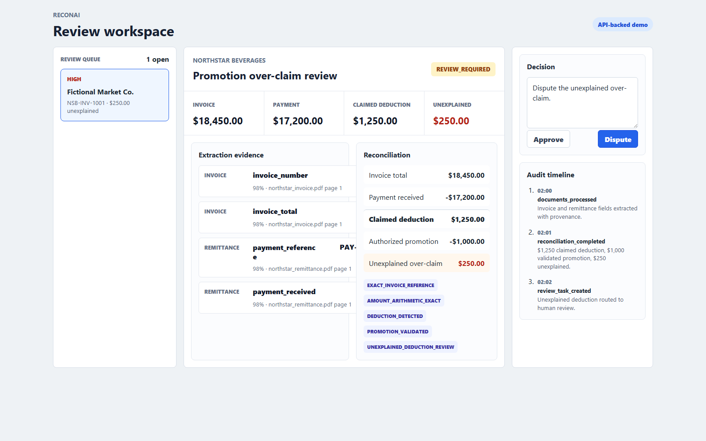
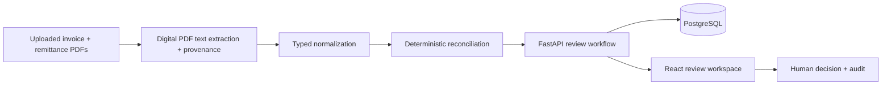

# ReconAI

**Financial reconciliation and deduction review for CPG accounts-receivable workflows.**

ReconAI ingests generated invoice and remittance PDFs, extracts structured evidence from their digital text layer, reconciles payments and promotional deductions using deterministic financial rules, and routes unexplained exceptions to auditable human review.

> **Portfolio prototype:** ReconAI uses reproducible generated financial data. No proprietary retailer or customer financial data is used.



## The Reconciliation Problem

| Item | Amount |
|---|---:|
| Invoice | $18,450 |
| Payment received | $17,200 |
| Claimed deduction | $1,250 |
| Authorized promotion | $1,000 |
| **Unexplained amount** | **$250** |

ReconAI validates the supported $1,000 promotion and routes the remaining $250 to `REVIEW_REQUIRED` instead of silently accepting the deduction.

The workflow preserves deterministic financial correctness while giving a human reviewer the evidence and audit history needed to approve or dispute an exception.

## What ReconAI Does

- Extracts invoice and remittance fields from digital PDFs with source provenance.
- Reconciles invoice, payment and deduction amounts using integer-cent deterministic rules.
- Validates promotion allowances and calculates unexplained deductions.
- Routes ambiguous, unsupported or contradictory cases to human review.
- Persists reviewer decisions in PostgreSQL.
- Records review state changes and audit events transactionally.

## Architecture



Uploaded PDF evidence is parsed through the existing digital-PDF text extractor, normalized into typed application data, and passed into deterministic reconciliation. React displays backend-owned values from FastAPI, and reviewer decisions are submitted back to the API. `ReviewService` validates legal state transitions, while `ReviewCaseRepository` persists the generated case, decision and audit events in PostgreSQL.

## Engineering Decisions

**Deterministic money:** Monetary values are represented in cents in application logic. Reconciliation arithmetic is handled by deterministic domain code, not delegated to a model.

**Human-in-the-loop review:** Low-confidence, contradictory or unsupported cases are routed to review instead of being forced into an automatic match.

**Transactional auditability:** Review state and its audit event are committed in the same PostgreSQL transaction. The backend test suite includes a simulated audit-insert failure that verifies the decision is rolled back.

**Concurrency and state protection:** The repository locks the review row before applying a decision, validates the current status, and rejects illegal repeated transitions with HTTP `409`.

**Generated benchmark:** Proprietary retailer financial data is inappropriate for a public portfolio, so ReconAI generates canonical financial truth first and evaluates the system against known expected outcomes.

**Evidence suggestions:** ReconAI includes a typed evidence-suggestion and validation layer that checks citations, deduction amounts and review reasons before a suggestion can be accepted. The current public implementation does not depend on a live LLM; deterministic reconciliation remains the source of financial truth.

**Digital PDF boundary:** The current prototype extracts structured fields from digital PDFs with a text layer using deterministic parsing. Image-only or scanned documents are treated as insufficient evidence; OCR is future work.

## Evaluation

ReconAI includes a reproducible generated benchmark covering 12 financial reconciliation failure-mode scenarios, including partial payments, promotion over-claims, duplicate documents and deductions, conflicting references, invalid arithmetic, and degraded/no-text evidence.

| Metric | Current generated benchmark |
|---|---:|
| Reconciliation scenarios | 12 |
| Extraction fields scored | 72 |
| Extraction fields matched exactly | 66 / 72 (91.7%) |
| Reconciliation status outcomes | 12 / 12 |
| Deduction amount outcomes | 12 / 12 |
| False automatic matches | 0 |

The degraded/no-text scenario is intentionally surfaced as insufficient evidence and human review rather than being silently accepted.

Reports:

- [Extraction metrics](data/benchmark/seed_20260806/reports/extraction_metrics.md)
- [Reconciliation metrics](data/benchmark/seed_20260806/reports/reconciliation_metrics.md)
- [Evidence metrics](data/benchmark/seed_20260806/reports/evidence_metrics.md)
- [Reliability metrics](data/benchmark/seed_20260806/reports/reliability_metrics.md)

ReconAI also includes a v2 linked financial benchmark whose invoice/payment relationships, remittance schemas and promotion evidence are generated from canonical truth. Public datasets are reference inputs for realistic structure and vocabulary only; raw external rows and documents are not redistributed.

| Linked benchmark metric | Result |
|---|---:|
| Linked financial cases | 150 |
| Generated documents | 335 |
| Extraction fields scored | 950 |
| Extraction fields matched exactly | 920 / 950 (96.8%) |
| Reconciliation cases scored by current domain engine | 120 / 150 |
| Reconciliation status outcomes | 90 / 120 |
| Reconciliation deduction outcomes | 120 / 120 |
| Unsupported or absent-document cases reported, not hidden | 30 |
| End-to-end cases scored | 115 |
| End-to-end status outcomes | 90 / 115 |
| End-to-end extraction-blocked cases | 15 |

The current reconciliation engine intentionally reports missing-remittance, one-payment-to-many-invoices and many-payments-to-one-invoice families as unsupported by the reconciliation-only scorer rather than counting them as successful. Those cases remain in the corpus as the next domain-model expansion target.

Linked benchmark reports:

- [Linked extraction metrics](data/benchmark/linked_seed_20260807/reports/extraction_metrics.md)
- [Linked reconciliation metrics](data/benchmark/linked_seed_20260807/reports/reconciliation_metrics.md)
- [Linked end-to-end metrics](data/benchmark/linked_seed_20260807/reports/end_to_end_metrics.md)
- [Benchmark source provenance](docs/BENCHMARK_SOURCE_PROVENANCE.md)

## Tech Stack

| Layer | Technology |
|---|---|
| Frontend | React, TypeScript, Vite |
| API | FastAPI, Python |
| Database | PostgreSQL |
| DB driver | psycopg |
| Validation | Pydantic |
| Document/extraction | Python PDF/text extraction pipeline |
| Evaluation | Python benchmark/evaluator modules |
| Local environment | Docker Compose |

## Run Locally

### Backend + PostgreSQL

```bash
docker compose up --build
```

This starts PostgreSQL and FastAPI. The API runs at:

- Health: `http://127.0.0.1:8000/health`
- FastAPI docs: `http://127.0.0.1:8000/docs`

### Frontend

In a second terminal:

```bash
cd apps/web
npm install
npm run dev
```

Open the review workspace at `http://127.0.0.1:5173`.

Use **Use sample documents** in the UI to process the generated golden invoice/remittance PDFs through the same backend extraction endpoint.

### Reset The Demo Case

For local/demo use only:

```bash
curl -X POST http://127.0.0.1:8000/api/v1/review-cases/golden/reset
```

### Verification Commands

```bash
python -m pytest -p no:cacheprovider
```

```bash
cd apps/web
npm run build
npm run check
```

```powershell
powershell -ExecutionPolicy Bypass -File scripts\check_migrations.ps1
```

## API Endpoints

| Method | Endpoint | Purpose |
|---|---|---|
| `GET` | `/health` | API health check |
| `GET` | `/api/v1/review-cases/golden` | Load the golden review case |
| `GET` | `/api/v1/review-cases/{case_id}` | Reload a processed review case |
| `POST` | `/api/v1/review-cases/golden/decision` | Approve or dispute the review case |
| `POST` | `/api/v1/review-cases/{case_id}/decision` | Approve or dispute a processed review case |
| `POST` | `/api/v1/review-cases/golden/reset` | Reset the local demo case |
| `POST` | `/api/v1/reconciliation/process` | Process uploaded invoice/remittance PDFs |
| `GET` | `/api/v1/reliability/demo` | Run reliability/idempotency demo evaluation |
| `GET` | `/api/v1/evidence/demo` | Run evidence suggestion validation demo |

Example decision request:

```json
{
  "decision": "dispute",
  "comment": "Dispute the unexplained $250 promotional over-claim."
}
```

A successful decision persists workflow state in PostgreSQL and adds a backend-created audit record. A repeated decision after the case is already approved or disputed returns HTTP `409`.

Example document-processing request:

```bash
curl -X POST http://127.0.0.1:8000/api/v1/reconciliation/process \
  -F "invoice=@data/benchmark/seed_20260806/evidence/s04_6811/invoice.pdf" \
  -F "remittance=@data/benchmark/seed_20260806/evidence/s04_6811/remittance.pdf"
```

## Project Structure

```text
apps/
  api/                 FastAPI application and review workflow
  web/                 React/TypeScript review workspace
packages/
  benchmark/           generated scenario creation and validation
  domain/              deterministic money and reconciliation logic
  extraction/          document extraction and evaluation
  evidence/            typed evidence suggestion guardrails
  reliability/         retry and idempotency evaluation
migrations/            PostgreSQL schema and seed migrations
data/benchmark/         generated evidence, ground truth and reports
docs/                   engineering and phase documentation
```

## Limitations

- The current benchmark is generated and intentionally small: 12 scenario families / cases, not a production-scale evaluation.
- ReconAI is a portfolio prototype, not an ERP, accounting platform or production deduction-management system.
- Degraded, image-only, scanned or no-text evidence is not OCRed in the current implementation and is routed to human review.
- The public implementation does not currently call a live LLM.
- Browser-level E2E automation and a larger held-out benchmark are planned but not yet implemented.
- Cloud deployment, enterprise authentication and ERP integrations are future work.

## Future Work

1. Expand the held-out benchmark across more document layouts and degradations.
2. Add browser-level E2E automation for the complete upload-to-review workflow.
3. Add OCR fallback for image-only/scanned PDFs behind the same validation path.
4. Strengthen case/tenant-scoped evidence retrieval and citation validation.
5. Add an optional LLM provider behind the existing deterministic validation layer.

## Demo

A 60-90 second walkthrough is the next recruiter-launch step. The intended demo flow is:

1. Open the review workspace and click **Use sample documents**.
2. Show the extracted invoice/remittance fields and provenance.
3. Explain the $18,450 invoice, $17,200 payment and $1,250 claimed deduction.
4. Show the $1,000 validated promotion and $250 unexplained amount.
5. Submit a dispute decision.
6. Reload or restart the API and show the `DISPUTED` state persisted from PostgreSQL.
